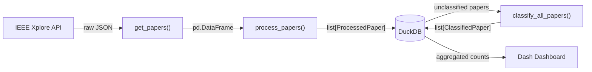

# IEEE Papers Mapper

Automated pipeline for fetching, classifying, and visualizing IEEE research papers using zero-shot NLP and a DuckDB analytical store.


## Architecture



### Pipeline Stages

| Stage | Input | Output | Validation |
|-------|-------|--------|------------|
| **Fetch** | API query params | `pd.DataFrame` (raw) | Raises `IEEEApiError` on HTTP/network failure |
| **Process** | Raw DataFrame | `list[ProcessedPaper]` | Pydantic validates every field: date format, non-negative counts, non-empty title, typed authors |
| **Store** | `ProcessedPaper` | DuckDB rows | Repository deduplicates on `is_number`, parameterized SQL throughout |
| **Classify** | Paper prompts | `list[ClassifiedPaper]` | Pydantic enforces confidence in [0.0, 1.0] |
| **Visualize** | DuckDB query | Plotly bar chart | Parameterized query (no SQL injection) |

### Key Design Decisions

- **Pydantic models at every boundary** -- `ProcessedPaper`, `ClassifiedPaper`, `Author` enforce data contracts. Bad data raises `PaperValidationError` immediately, never silently propagates as NaN.
- **Repository pattern** -- `Database` manages connections and schema; `PaperRepository` handles typed CRUD. No raw dicts cross the boundary.
- **Lazy-loaded classifier** -- The 700MB DeBERTa model loads on first classification call, not at import time. Module import takes <0.3s.
- **Custom exceptions** -- `IEEEApiError` and `PaperValidationError` replace silent error swallowing. The pipeline catches API errors per-category and continues.
- **Incremental fetching** -- `ProgressTracker` persists pagination state to JSON, so interrupted runs resume where they left off.

## Quick Start

```bash
git clone https://github.com/alex-anast/ieee-papers-mapper.git
cd ieee-papers-mapper
cp .env.example .env          # add your IEEE_API_KEY
make install                   # creates venv, installs deps + package
make check                     # lint + 27 tests
```

Run the pipeline (fetches, classifies, stores):

```bash
ieee-papers run                   # one-shot
ieee-papers run --hours 24        # repeat every 24h
```

Launch the dashboard:

```bash
ieee-papers dashboard             # http://localhost:8050
```

Check system health:

```bash
ieee-papers verify
```

### Docker

```bash
cp .env.example .env          # add your IEEE_API_KEY
make docker-build && make docker-up
# Dashboard at http://localhost:8050
# Pipeline runs every 24h in the background
```

## Project Structure

```
src/ieee_papers_mapper/
    models.py              Pydantic: Author, ProcessedPaper, ClassifiedPaper
    exceptions.py          IEEEApiError, PaperValidationError
    main.py                Entry point (scheduler)
    config/
        config.py          Environment-sourced settings
        scheduler.py       APScheduler wrapper (DI, run-on-start)
        logging_config.py  Structured JSON logging
    data/
        get_papers.py      IEEE API client
        process_papers.py  Raw data -> validated models
        classify_papers.py Zero-shot DeBERTa (lazy-loaded)
        database.py        Connection + schema (DDL)
        repository.py      Typed CRUD (Pydantic in, SQL out)
        pipeline.py        Orchestration: fetch -> process -> store -> classify
    app/
        dash_webapp.py     Plotly Dash dashboard
```

## Testing

```bash
make test            # 27 tests, ~0.6s (no model loading)
make test-verbose    # full output
make check           # lint + tests (the CI gate)
make dash-smoke      # boot dashboard, verify HTTP 200, tear down
```

See the [Testing Runbook](docs/developer_guide/testing_runbook.md) for manual smoke tests (API fetch, full pipeline, DB inspection).

## Tech Stack

| Component | Technology |
|-----------|-----------|
| Language | Python 3.12 |
| Database | DuckDB |
| NLP | HuggingFace Transformers (DeBERTa-v3-large zero-shot) |
| Dashboard | Plotly Dash |
| Scheduling | APScheduler |
| Validation | Pydantic |
| Logging | python-json-logger (structured JSON) |
| CI | GitHub Actions (black + pytest) |
| Deployment | Docker Compose (dashboard + pipeline services) |

## Documentation

Full docs: [https://alex-anast.github.io/ieee-papers-mapper/](https://alex-anast.github.io/ieee-papers-mapper/)

## License

MIT. See [LICENSE](./LICENSE).

## Contact

Alexandros Anastasiou -- [anastasioyaa@gmail.com](mailto:anastasioyaa@gmail.com)
