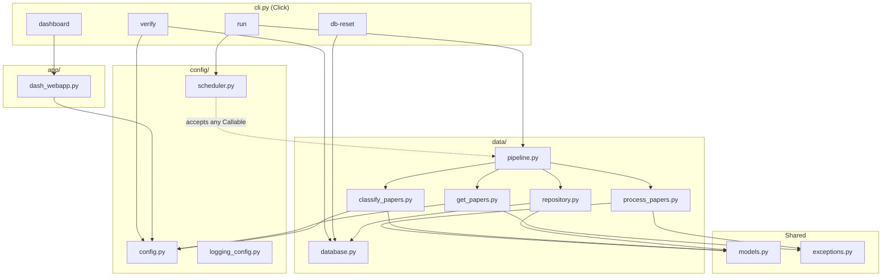

# Code Structure

The project follows a Python src-layout (`src/ieee_papers_mapper/`) with clear separation of concerns across three packages: configuration, data pipeline, and web application.

## Project Layout

```
src/ieee_papers_mapper/
    cli.py              Click CLI: run, dashboard, verify, db-reset
    models.py           Pydantic models: Author, ProcessedPaper, ClassifiedPaper
    exceptions.py       Custom exception hierarchy
    main.py             Legacy entry point (scheduler via argparse)

    config/
        config.py           Environment-sourced settings and constants
        scheduler.py        APScheduler wrapper (accepts any callable)
        logging_config.py   Structured JSON logging setup

    data/
        get_papers.py       IEEE Xplore API client
        process_papers.py   Raw API data -> validated ProcessedPaper models
        classify_papers.py  Zero-shot classification (lazy-loaded DeBERTa)
        database.py         Connection lifecycle and schema management (DDL)
        repository.py       CRUD operations with typed Pydantic models
        pipeline.py         Orchestrates fetch -> process -> store -> classify

    app/
        dash_webapp.py      Plotly Dash dashboard for paper counts by category
```

## Architecture Diagram



## Module Responsibilities

### `cli.py`

The Click-based command-line interface. Defines four commands:

- **`run`** -- Executes the pipeline. In one-shot mode (no interval flags), it calls `run_pipeline()` directly. With interval flags, it creates a `Scheduler` that runs the pipeline repeatedly.
- **`dashboard`** -- Imports and starts the Dash web application.
- **`verify`** -- Checks API key presence, database existence and table row counts, and classifier availability.
- **`db-reset`** -- Deletes the DuckDB file and WAL, then recreates the schema.

### `models.py`

Three Pydantic models that define data contracts between pipeline stages:

- **`Author`** -- `author_id`, `full_name`, `affiliation`.
- **`ProcessedPaper`** -- Validated paper record with field constraints: `download_count >= 0`, `citing_patent_count >= 0`, `title` non-empty, `insert_date` in ISO 8601 format. Includes parsed authors and index terms.
- **`ClassifiedPaper`** -- Classification result with `confidence` constrained to `[0.0, 1.0]`.

### `exceptions.py`

A three-class hierarchy:

- **`IEEEPapersError`** -- Base exception for the project.
- **`IEEEApiError`** -- Raised by `get_papers()` when the IEEE API request fails.
- **`PaperValidationError`** -- Raised by `process_papers()` when a row fails Pydantic validation.

### `config/config.py`

Centralised settings loaded from environment variables (via `python-dotenv`) and hardcoded constants. Defines API parameters, directory paths, database table names, search categories, and the classifier model name.

### `config/scheduler.py`

Wraps APScheduler's `BackgroundScheduler`. Accepts any callable via dependency injection. Runs the job immediately on `start()`, then repeats at the configured interval. Defaults to weekly if no interval is provided.

### `config/logging_config.py`

Configures structured JSON logging using `python-json-logger`. All modules use a shared `ieee_logger` logger. Log fields include timestamp, level, module, function name, and message.

### `data/get_papers.py`

IEEE Xplore API client. Sends a parameterized GET request and normalizes the JSON response into a Pandas DataFrame. Returns an empty DataFrame when no results are found. Raises `IEEEApiError` on any `requests` exception.

### `data/process_papers.py`

Transforms raw DataFrame rows into `ProcessedPaper` models. Handles date parsing (`YYYYMMDD` to `YYYY-MM-DD`), nested author extraction, index term parsing (handles both list and string representations), and prompt construction. Raises `PaperValidationError` on any validation failure.

### `data/classify_papers.py`

Zero-shot classification using DeBERTa-v3-large. The classifier is a module-level singleton (`_classifier`) loaded lazily on first call to `_get_classifier()`. `classify_text()` classifies a single text; `classify_all_papers()` iterates over a DataFrame of unclassified papers and returns `ClassifiedPaper` models.

### `data/database.py`

Manages the DuckDB connection lifecycle and schema DDL. The `Database` class creates tables in foreign-key order on first run, and only creates missing tables on subsequent runs. Handles connection opening and closing.

### `data/repository.py`

Typed CRUD operations. `PaperRepository` accepts Pydantic models and executes parameterized SQL. Key methods: `insert_full_paper()` (inserts across all related tables, skipping duplicates), `get_unclassified_papers()` (returns papers without classifications), and `insert_classifications()` (bulk-inserts via a registered DataFrame view).

### `data/pipeline.py`

Orchestration module. `run_pipeline()` initialises the database, fetches papers per category with incremental pagination, stores them via the repository, then classifies any unclassified papers. Also defines `ProgressTracker` for pagination state persistence.

### `app/dash_webapp.py`

Plotly Dash application. Queries DuckDB for paper counts by category (filtered by confidence threshold) and renders a bar chart. Uses a `dcc.Interval` component to auto-refresh every 10 seconds.

---

## Design Decisions

### Pydantic at Every Boundary

`ProcessedPaper`, `ClassifiedPaper`, and `Author` enforce data contracts between pipeline stages. Validation happens at the point of creation, not downstream. This means:

- A malformed date in the API response raises `PaperValidationError` in `process_papers()`, not a cryptic SQL error in `repository.py`.
- A confidence score outside `[0.0, 1.0]` is caught immediately, not stored as corrupt data.
- The repository can trust that its inputs are well-formed.

### Repository Pattern

Two classes split responsibility:

- **`Database`** -- Connection lifecycle, schema DDL, table existence checks. Knows about DuckDB internals.
- **`PaperRepository`** -- CRUD operations. Accepts Pydantic models, returns typed results. No raw dictionaries cross this boundary.

This separation makes it possible to swap the storage backend without touching the business logic, and to test the repository with a fresh in-memory database.

### Lazy Classifier

The DeBERTa model is ~700 MB. Loading it eagerly would make every import slow and every test that touches `classify_papers` download the model. Instead, the model is loaded on first call to `classify_text()`:

```python
_classifier = None

def _get_classifier():
    global _classifier
    if _classifier is None:
        from transformers import pipeline as hf_pipeline
        _classifier = hf_pipeline("zero-shot-classification", model=cfg.DEBERTA_V3_MODEL_NAME)
    return _classifier
```

This keeps module import time under 0.3 seconds and means the model is only downloaded when classification is actually requested.

### Custom Exceptions

`IEEEApiError` and `PaperValidationError` replace generic exception handling. The pipeline catches `IEEEApiError` per-category and continues with remaining categories, rather than aborting the entire run. `PaperValidationError` is always fatal for the affected record.

### ProgressTracker

Pagination state is persisted as a JSON file mapping category names to their last-fetched `start_record`. This makes incremental fetching simple and debuggable -- you can inspect or edit the JSON file directly to resume from a specific point.

### Dependency Injection in the Scheduler

`Scheduler.__init__()` accepts any `Callable`, not a hardcoded import of `run_pipeline`. This makes the scheduler testable with mock jobs and reusable for other periodic tasks.

---

## Data Flow: Tracing a Paper from API to Dashboard

1. **API response** -- The IEEE Xplore API returns a JSON array of article objects.

2. **`get_papers()`** -- `pd.json_normalize()` flattens the nested JSON into a DataFrame. Each row is one paper with columns like `title`, `abstract`, `authors.authors`, `index_terms.ieee_terms.terms`, `is_number`, `insert_date`.

3. **`process_papers()`** -- Each row is parsed into a `ProcessedPaper`. Authors are extracted from the nested `authors.authors` column into `Author` models. The `insert_date` is reformatted from `YYYYMMDD` to `YYYY-MM-DD`. A classification prompt is constructed from the title, abstract, and index terms.

4. **`PaperRepository.insert_full_paper()`** -- The `ProcessedPaper` is decomposed into inserts across five tables:
    - `papers` -- Core metadata (title, abstract, dates, counts). Returns the auto-generated `paper_id`.
    - `authors` -- One row per author, linked by `paper_id`.
    - `index_terms` -- One row per term (both IEEE and dynamic types), linked by `paper_id`.
    - `prompts` -- The classification prompt text, linked by `paper_id`.

5. **`classify_all_papers()`** -- Unclassified papers are queried via `get_unclassified_papers()` (a JOIN between `papers` and `prompts` where no `classification` row exists). Each prompt is fed to the DeBERTa classifier, producing `(category, confidence)` tuples wrapped in `ClassifiedPaper` models.

6. **`PaperRepository.insert_classifications()`** -- Classifications are bulk-inserted into the `classification` table via a registered DataFrame view.

7. **`dash_webapp.py`** -- The dashboard queries `SELECT category, COUNT(*) FROM classification JOIN papers ... WHERE confidence >= 0.5 GROUP BY category` and renders the result as a Plotly bar chart.

---

## Supporting Files

| File | Purpose |
|------|---------|
| `Makefile` | Dev runbook: install, lint, format, test, db-reset, dash-smoke, docker-build/up/down/logs |
| `pyproject.toml` | Package metadata, dependencies, console script entry point (`ieee-papers = ieee_papers_mapper.cli:cli`) |
| `Dockerfile` | Container image for both services |
| `docker-compose.yml` | Two-service deployment: `dashboard` (Dash app) + `pipeline` (scheduled fetcher) |
| `.env.example` | Template for the `.env` file with `IEEE_API_KEY` |
| `mkdocs.yml` | MkDocs configuration for this documentation site |
| `.github/workflows/` | GitHub Actions CI: runs `black --check` and `pytest` on push |
