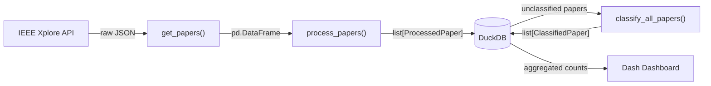

# Overview

The IEEE Papers Mapper provides an end-to-end pipeline for fetching research papers from the IEEE Xplore API, validating and storing them in a DuckDB analytical database, classifying them with a zero-shot transformer model, and displaying the results in an interactive web dashboard.

## Pipeline Architecture

## Pipeline Stages

### 1. Data Retrieval (`get_papers`)

The pipeline starts by querying the IEEE Xplore API for each configured search category (e.g., "machine learning", "power electronics", "robotics"). The raw JSON response is normalized into a Pandas DataFrame. If the API returns an error or the network is unreachable, an `IEEEApiError` is raised and the pipeline moves on to the next category.

Pagination is handled incrementally: `ProgressTracker` persists the last-fetched `start_record` per category into a JSON file, so interrupted runs resume exactly where they left off rather than re-fetching from the beginning.

### 2. Data Processing (`process_papers`)

Raw DataFrame rows are transformed into validated `ProcessedPaper` Pydantic models. This stage parses dates from the IEEE `YYYYMMDD` format to ISO 8601, extracts author metadata into `Author` models, parses IEEE and dynamic index terms, and constructs a classification prompt from the title, abstract, and terms.

Any row that fails Pydantic validation raises a `PaperValidationError` immediately. The project treats data quality as a hard requirement -- malformed records are never stored.

### 3. Storage (DuckDB + Repository)

Validated papers are persisted through the `PaperRepository`, which inserts across five normalized tables: `papers`, `authors`, `index_terms`, `prompts`, and `classification`. The repository deduplicates on `is_number` (the IEEE article identifier), so re-running the pipeline for the same papers is safe.

The underlying `Database` class manages connection lifecycle and DDL. Tables are created automatically on first run with correct foreign-key ordering.

### 4. Classification (`classify_all_papers`)

Unclassified papers are retrieved from the database and passed through the DeBERTa-v3-large zero-shot classifier. The model is lazy-loaded on first use (not at import time), which keeps module imports fast and avoids the ~700 MB download until classification is actually needed.

Each paper is classified against all configured categories with `multi_label=True`, producing a list of `ClassifiedPaper` models with confidence scores clamped to `[0.0, 1.0]` by Pydantic.

### 5. Visualization (Dash Dashboard)

The Plotly Dash web application queries DuckDB for aggregated paper counts per category (filtered by a configurable confidence threshold, default 0.5) and renders them as an auto-refreshing bar chart. The chart updates every 10 seconds to reflect new classification results.

## Pipeline Stages Summary

| Stage | Input | Output | Validation |
|-------|-------|--------|------------|
| **Fetch** | API query params | `pd.DataFrame` (raw) | Raises `IEEEApiError` on HTTP/network failure |
| **Process** | Raw DataFrame | `list[ProcessedPaper]` | Pydantic validates every field: date format, non-negative counts, non-empty title, typed authors |
| **Store** | `ProcessedPaper` | DuckDB rows | Repository deduplicates on `is_number`, parameterized SQL throughout |
| **Classify** | Paper prompts | `list[ClassifiedPaper]` | Pydantic enforces confidence in [0.0, 1.0] |
| **Visualize** | DuckDB query | Plotly bar chart | Parameterized query (no SQL injection) |

## Key Design Decisions

**Pydantic models at every boundary.** `ProcessedPaper`, `ClassifiedPaper`, and `Author` enforce data contracts between pipeline stages. Bad data raises `PaperValidationError` immediately rather than propagating as NaN or empty strings through downstream stages.

**Lazy-loaded classifier.** The DeBERTa-v3-large model (~700 MB) is loaded on first call to `classify_text()`, not at import time. This means module imports complete in under 0.3 seconds, tests run without loading the model, and the download only happens when classification is actually requested.

**Incremental fetching with ProgressTracker.** Pagination state is persisted to a JSON file per category. If the pipeline is interrupted mid-fetch, it resumes from the last saved `start_record` instead of re-fetching everything from the beginning.

**Repository pattern.** `Database` handles connection lifecycle and schema DDL; `PaperRepository` handles typed CRUD operations that accept and return Pydantic models. No raw dictionaries cross the repository boundary.

**Custom exceptions.** `IEEEApiError` and `PaperValidationError` replace silent error swallowing. The pipeline catches API errors per-category and continues with the remaining categories.

**Dependency injection in the scheduler.** The `Scheduler` class accepts any callable, not a hardcoded import of the pipeline function. This makes it testable and reusable.
